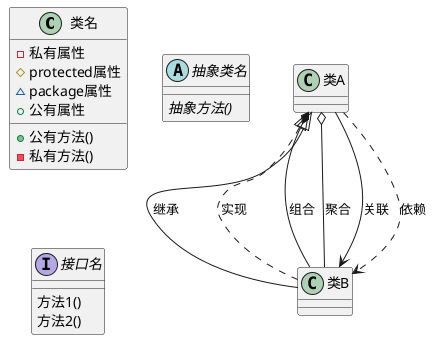
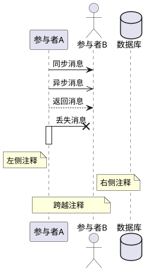
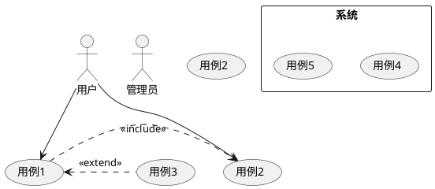
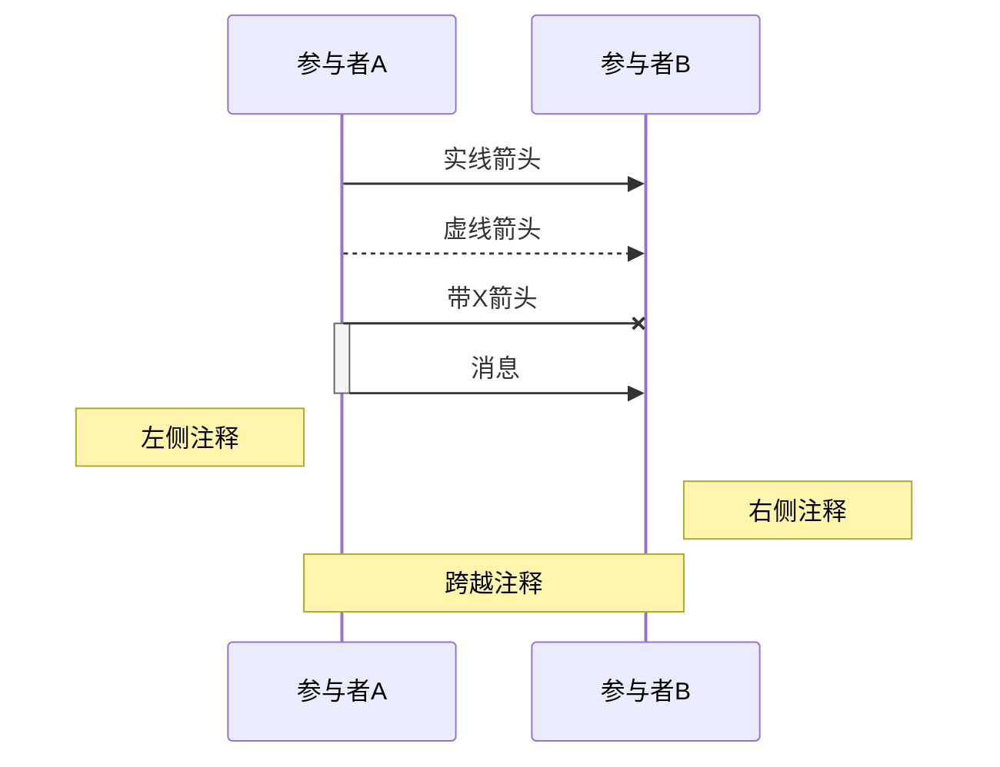
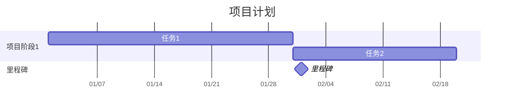
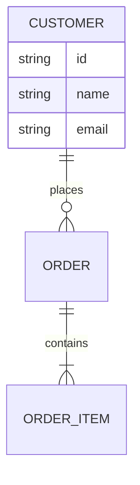
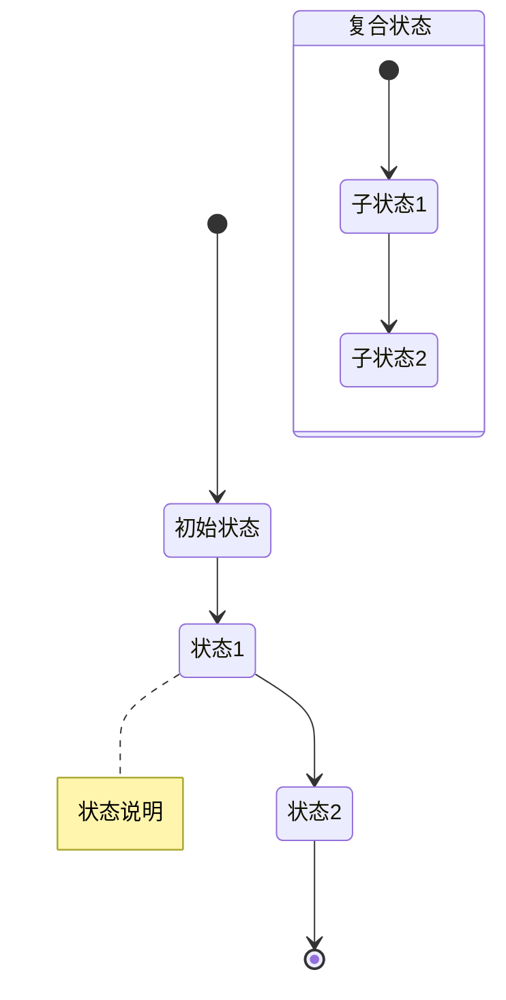

# UML和Mermaid语法详解

## UML语法（PlantUML）

### 1. 类图语法



### 2. 序列图语法



### 3. 用例图语法



## Mermaid语法

### 1. 流程图语法

```mermaid
graph TD
    %% 节点定义
    A[方框]
    B(圆角框)
    C{菱形}
    D((圆形))
    E>不对称形状]
    
    %% 连接线
    A --> B    %% 箭头
    B --- C    %% 直线
    C -.-> D   %% 虚线箭头
    C ==> E    %% 粗箭头
    
    %% 带文本的连接
    A -->|是| B
    A -->|否| C
    
    %% 子图
    subgraph 子图标题
        子图内容
    end
```

### 2. 序列图语法



### 3. 甘特图语法



### 4. ER图语法



### 5. 状态图语法



## 常用技巧

### 1. 样式设置

- PlantUML
```plantuml
@startuml
skinparam classAttributeIconSize 0
skinparam backgroundColor #EEEBDC
skinparam handwritten true

' 更多样式设置...
@enduml
```

- Mermaid


### 2. 布局控制

- PlantUML
```plantuml
@startuml
left to right direction
' 或
top to bottom direction
@enduml
```

- Mermaid
```mermaid
graph LR  % 左右布局
% 或
graph TD  % 上下布局
```

## 最佳实践

1. **命名规范**
   - 使用清晰、有意义的标识符
   - 保持命名风格一致
   - 避免特殊字符

2. **布局建议**
   - 保持图表简洁
   - 合理使用空间
   - 避免交叉线过多

3. **注释使用**
   - 适当添加注释说明
   - 使用注释解释复杂逻辑
   - 保持注释简洁明了 